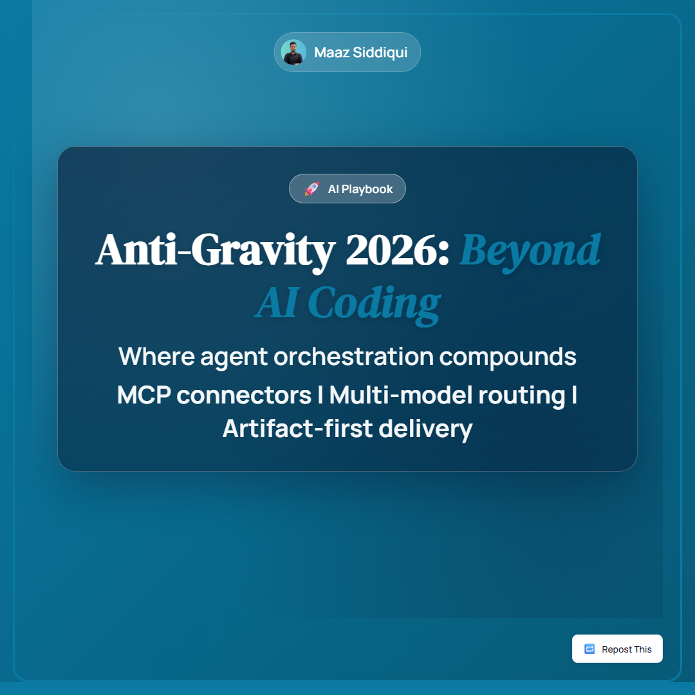
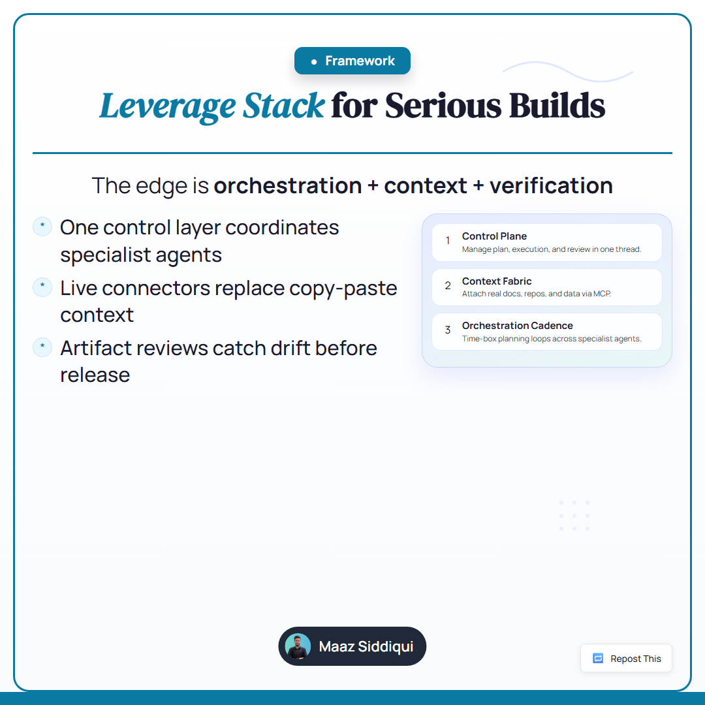
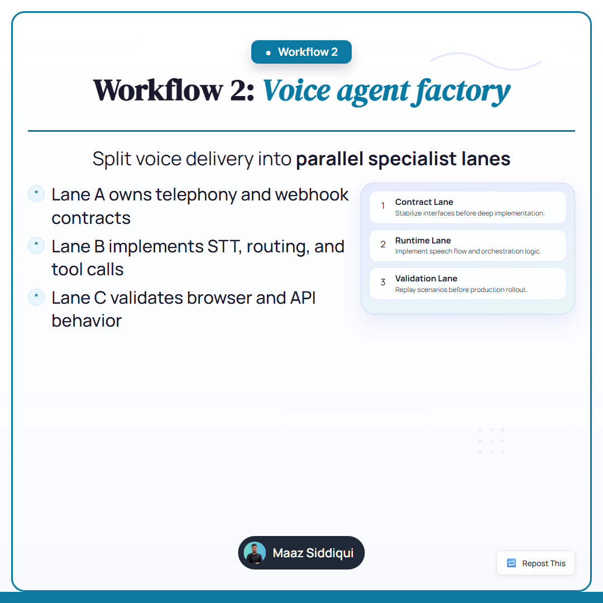

# AntiGravity Slides Generator

[](LICENSE)
[](https://nodejs.org/)
[](https://github.com/Maazsiddiqui01/linkedin-carousel-generator/actions)

> AI-powered LinkedIn carousel planner and renderer with deterministic quality gates.

Turn a topic or rough outline into **production-ready** carousel assets — JSON content spec, rendered slide PNGs, final PDF, validation + intelligence logs, and copy/design overseer reports — all in one command.

## Sample Output

<p align="center">
  
  
  
</p>

---

## Core Capabilities

| Feature | Description |
|---|---|
| **Intent-aware slides** | Each body slide has a narrative intent (`workflow`, `result`, `milestone`, `proof`, …) |
| **Contextual top chip** | Single relevant chip — no generic forced badges |
| **Visual panel modes** | KPI / cards / chart / image — one per slide, with anti-duplication guards |
| **Chart generation** | Deterministic chart asset rendering from explicit data |
| **Image prompt packs** | Optional Imagen-compatible prompt generation |
| **Full pipeline** | One command: plan → chart → render → validate → overseer → done |

---

## Quick Start

### 1. Prerequisites

- **Node.js 18+** (recommended 20+)
- **npm**

### 2. Install

```bash
npm ci
npx playwright install chromium
```

### 3. Run a Full Build

```bash
npm run build-carousel -- content/final/20260223_antigravity_overseer_masterpiece.json
```

This runs the complete pipeline:

1. Chart generation
2. Image prompt generation
3. HTML → PNG → PDF rendering
4. Content + layout validation
5. Copy & design overseer checks
6. Performance-log scaffold

### 4. Main Outputs

| Output | Path |
|---|---|
| Final PDF | `output/pdf/<slug>.pdf` |
| Slide images | `output/images/<slug>/slide_*.png` |
| Validation report | `logs/<slug>_validation.json` |
| Render intelligence | `logs/<slug>_render_intelligence.json` |
| Copy overseer | `logs/<slug>_copy_overseer.json` |
| Design overseer | `logs/<slug>_design_overseer.json` |
| Build manifest | `logs/<slug>_build_manifest.json` |
| Performance log | `logs/performance/<slug>.json` |

---

## Key Commands

```bash
# Full pipeline (recommended)
npm run build-carousel -- <content-spec.json>

# Individual steps
npm run render -- <content-spec.json>
npm run validate -- <content-spec.json>
npm run overseer -- <content-spec.json>
npm run generate-charts -- <content-spec.json>
npm run generate-images -- <content-spec.json>
```

---

## Project Structure

```
├── directives/        # Operating rules, quality policies, visual engine config
├── schemas/           # JSON schema for content specs
├── templates/html/    # Deterministic slide template + styles
├── scripts/           # Generation, rendering, validation, orchestration
├── content/           # Content specs (drafts, final, regression tests)
├── brand/             # Brand rules, colors, typography, logo assets
├── output/            # Generated PNGs, PDFs, charts, images
├── logs/              # Validation, intelligence, overseer, build logs
├── Sample/            # Example carousel output
└── docs/              # Guides: overview, GitHub setup, prompting
```

---

## Documentation

| Doc | Purpose |
|---|---|
| [Repo Overview](docs/REPO_OVERVIEW.md) | Architecture and design concepts |
| [GitHub Setup](docs/GITHUB_SETUP.md) | Publish and maintain the repo |
| [Prompt Best Practices](docs/prompting/PROMPT_BEST_PRACTICES.md) | How to write effective carousel prompts |
| [Prompt Examples](docs/prompting/PROMPT_EXAMPLES.md) | Ready-to-use prompt templates |
| [Contributing](CONTRIBUTING.md) | Contribution workflow and standards |
| [Security](SECURITY.md) | Reporting vulnerabilities |
| [Code of Conduct](CODE_OF_CONDUCT.md) | Community guidelines |

---

## Environment Variables (Optional)

| Variable | Purpose |
|---|---|
| `GEMINI_API_KEY` | AI image generation (Imagen-compatible) |
| `GOOGLE_API_KEY` | Alternative to `GEMINI_API_KEY` |
| `CANVA_CLIENT_ID` | Canva API integration |
| `CANVA_CLIENT_SECRET` | Canva API integration |

Without image generation keys, prompt packs are still generated for manual use.

---

## License

MIT — see [LICENSE](LICENSE).
